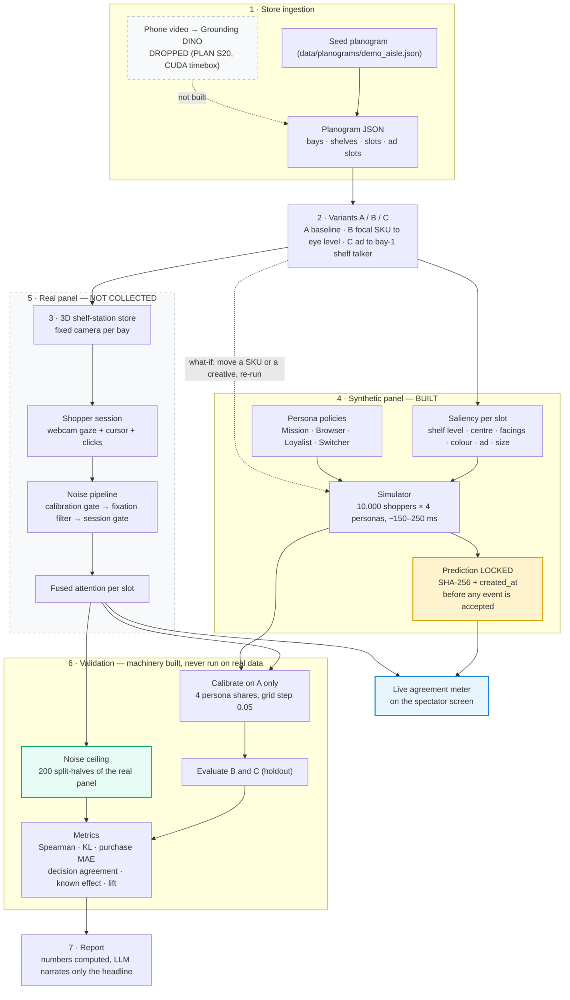

# ShopperTwin — AI-Persona Panels

A browser 3D shelf store where real people shop with webcam gaze tracking, and AI shopper
personas shop the same store autonomously. Both panels are served the *same* resolved planogram
document, so they walk an identical aisle. Before each real shopper is allowed to record a single
event, the synthetic prediction for their variant is simulated, hashed with SHA-256 and written
to disk — the commitment is fixed before the behaviour exists. We then report how closely
synthetic matches real, benchmarked against the real panel's *own* split-half repeatability
rather than against 1.0; personas that clear that bar are then used to answer the question a brand
actually asks: which shelf position and which ad placement change what people buy.

NIQ Innovation Council hackathon · team Media Mavericks.

---

## Read this before the rest

> **There is no real panel yet.** `data/sessions/anon/` is empty. Nobody has shopped a recorded
> session, so every real-vs-synthetic number in `RESULTS.md` reads **`not yet collected`** — not
> `0.00`, and not an omitted row you could mistake for a zero. The synthetic half of the study is
> computed and reproducible. The comparison the project exists to make **has not been made.**
>
> The same applies to the persona decision traces: `sim/slow_agent.py` is built and tested, but
> there is no LLM key in this repository and it refuses to write traces produced by a test double,
> so `data/cache/traces/` is empty.
>
> [What is built and what is not](#what-is-built-and-what-is-not) · [Limitations](docs/METHODOLOGY.md#12-limitations)

## What it produces

Three outputs, in increasing value (PLAN §1):

1. **Attention** — an Ad Slot Attention Index per persona: what gets seen. *Built.*
2. **Ad-to-Purchase Lift** — what the exposure was worth. Attention alone is a commodity;
   predictive-attention vendors already sell heatmaps. This is the number they cannot produce,
   because they do not model purchase. *Built, and computed for the synthetic panel.*
3. **Placement optimizer** — search every slot × creative and recommend the best.
   **Not started** (S24, Phase 2). This is the jump from an A/B tool to a recommendation engine,
   and it is the one of the three that does not exist.

---

## Architecture

The study pipeline. (Both diagrams also live as standalone files:
[`docs/flow-diagram.mermaid`](docs/flow-diagram.mermaid) and, for the module-level view of who
owns what and which process it runs in, [`docs/working-diagram.mermaid`](docs/working-diagram.mermaid).)



Three architecture facts that are load-bearing and easy to get wrong:

- **`resolve()` exists once, on the server** (`api/app/resolve.py`). The web app fetches
  `GET /variants/{id}/resolved`. There is no TypeScript resolver, so the two panels cannot drift.
- **The fixation filter exists once, in the browser** (`web/src/capture/FixationFilter.ts`). The
  server stores fixations as received.
- **The attention formula exists once** (`analytics/fusion.py`). `api/app/live.py` imports it for
  the live meter; a parity test replays a recorded session through the WebSocket and asserts the
  result equals the offline computation.

## Demo GIF

**Not recorded.** SPEC M8 asks for a 15-second GIF of the what-if panel here and there is no
`make readme-gif` target; recording it is a manual step described in
[`docs/video/shotlist.md`](docs/video/shotlist.md) (shot 5). Rather than link an image that does
not exist, here is what the shot shows and how to reproduce it live in about a minute:

```
make api            # terminal 1
make web            # terminal 2
# open http://localhost:5173/#/whatif
# move SKU_008 from the bottom shelf to eye level
```

The panel re-runs 10,000 synthetic shoppers per persona and prints `elapsed_ms` on screen —
labelled as server compute, not as a wall-clock promise. The acceptance test measures 20 warm
in-process calls and prints the result on every run; two consecutive runs gave **p50 6.3 / p95
6.8 ms** and **p50 5.7 / p95 7.0 ms**, against a 1,000 ms budget. The first call after startup is
slower, which is what the startup warm-up exists to absorb.

## How to run

**Activate your virtualenv first.** The Makefile and `make.bat` both invoke a bare `python`, so
on a machine where the interpreter is only reachable as `py`, `python3` or
`.venv/Scripts/python.exe` every target fails on its first line. Either activate
(`.venv\Scripts\activate` / `source .venv/bin/activate`) or call the scripts directly with the
interpreter you want.

```bash
# Windows                     # macOS / Linux
make.bat setup                make setup
make.bat api    # terminal 1  make api        # :8000
make.bat web    # terminal 2  make web        # :5173
```

`make setup` installs the pinned Python and Node dependencies, generates the seed planogram,
variants, personas and product textures, then validates every data file against its schema.
Textures and figures are generated artifacts and are gitignored, so `make seed` must run before
the store will render.

| Command | Does |
|---|---|
| `make setup` | Install, seed, validate |
| `make seed` | Regenerate planogram, variants, personas, textures |
| `make validate` | Check every data file against `schemas/` — currently **12 files, 0 errors** |
| `make gen-types` | Regenerate `web/src/contracts/` and `api/app/schemas.py` from `schemas/` |
| `make api` / `make web` | FastAPI on `:8000` / Vite on `:5173` |
| `make test` | `pytest` + `vitest` — **463 Python tests and 315 web tests across 30 files, all green** at the time of writing |
| `make eval` | Regenerate `RESULTS.md` and `docs/figures/*.png` from committed evidence |

There is no `make demo` and no `make readme-gif` (PLAN §13 cut Docker Compose and `make demo`;
the GIF target was never built). There is **no CI workflow** — SPEC M8 asks for
`.github/workflows/ci.yml` and it was not built, so there is no badge to put here.

Screens, once both servers are up:

| URL | What it is |
|---|---|
| `http://localhost:5173/` | The capture flow, then the store. This is the shopper's screen: no gaze dot, no metrics. |
| `…/#/spectator?session=<id>` | Second monitor. Gaze trail, live heatmap vs the locked prediction, agreement meter, prediction badge, clock. |
| `…/#/spectator?session=demo&fake=1` | The server's synthetic demo stream, for when no session is running. It draws itself with a yellow border and a banner so a fake frame can never be mistaken for a real one. |
| `…/#/whatif` | Move a SKU or a creative, re-run the population, read the lift. |
| `…/#/dashboard?session=<id>&variant=<id>` | Real vs synthetic attention bars, Spearman, purchase-share MAE for one session. |

Copy `.env.example` to `.env` and add an LLM key before generating persona policies or traces.
`LLM_OFFLINE=1` serves everything from `data/cache/` with no network.

## Headline results

Copied from [`RESULTS.md`](RESULTS.md), which `make eval` regenerates from committed evidence and
which may not be edited by hand. Experiment `eval-0029dcf1332c`; synthetic panel 10,000 shoppers
per variant across 4 personas at seed 42; synthetic attention fused in `cursor_only` mode.

**Real panel: n = 0 accepted, 0 rejected. Prediction locks found: 0.**

Real vs synthetic, per variant:

| Variant | Real n | Attention Spearman | Heatmap KL | Purchase-share MAE | Ad Slot Index Spearman |
|---|---|---|---|---|---|
| A — Baseline | 0 | not yet collected | not yet collected | not yet collected | not yet collected |
| B — Focal SKU at eye level | 0 | not yet collected | not yet collected | not yet collected | not yet collected |
| C — Ad on the bay-1 shelf talker | 0 | not yet collected | not yet collected | not yet collected | not yet collected |

Split-half repeatability of the real panel (the noise ceiling every accuracy number would be
quoted against): **not yet collected**. Calibration fit and holdout: **not yet collected** —
calibration is fitted on variant A's real panel and there is none.

The synthetic panel on its own, which needs no human:

| Variant | Focal slot | Focal attention | Focal purchase share | Ad-to-Purchase Lift (Crunch) |
|---|---|---|---|---|
| A | `B1S5P1` (bottom) | 0.0267 | 0.0211 | 0.04 |
| B | `B1S3P2` (eye) | 0.0497 | 0.0454 | 0.03 |
| C | `B1S5P1` (bottom) | 0.0254 | 0.0205 | 0.13 |

**The known effect.** Variant B moves `SKU_008` from the bottom shelf to eye level. The
synthetic panel recovers it: fused attention **0.0267 → 0.0497, uplift +0.86**. The real panel's
side of this comparison — and therefore the `same_direction` flag that makes it a *check* rather
than a number — is not yet collected.

**Ad-to-Purchase Lift**, synthetic side only (the 95 % interval is a bootstrap over the real
panel's shoppers, so there is none):

| Segment | browser | switcher | population | loyalist | mission |
|---|---|---|---|---|---|
| Synthetic lift | 0.32 | 0.11 | 0.04 | 0.02 | −0.08 |

Lift is **not** monotonic in `ad_receptivity` for the mission and loyalist personas on this aisle;
it is strictly monotonic on a single-bay symmetric store where the mechanism is isolated. Both
causes are understood and written up in
[METHODOLOGY §12.6](docs/METHODOLOGY.md#126-ad-to-purchase-lift-is-not-monotonic-in-ad_receptivity-for-every-persona-on-this-aisle).

**Engineering numbers**, which *are* measured, because they measure this code and not shoppers:

| | Measured | Budget |
|---|---|---|
| 10,000 shoppers × 4 personas | 142 ms (252 ms on a second machine) | 800 ms |
| `POST /whatif`, 20 warm in-process calls | p95 6.8 ms and 7.0 ms on two runs | p95 < 1,000 ms |
| Calibration grid, 1,771 candidates | 0.79 s | — |
| Persona-share recovery from a known mix | worst per-share error 0.05 | ±0.10 |
| `exploration = 1` vs pure saliency | worst per-target deviation 0.0037 | 0.02 |

Figures (`docs/figures/heatmap_A|B|C.png`) are written by `make eval` and are gitignored, so they
exist only after you run it. `agreement_vs_ceiling.png`, `calibration_fit_vs_holdout.png` and
`reject_reasons.png` are **deliberately not drawn** — `scripts/eval.py` refuses to render a chart
whose bars would all be zero, because an axis of zero-height bars reads as a measured zero.

## What is built and what is not

**Built, tested, demonstrable today**

- Nine JSON Schemas as the only cross-track contract, with generated TypeScript and Pydantic
  mirrors (`make gen-types`).
- Deterministic saliency and a vectorised numpy simulator (S2).
- FastAPI with server-side `resolve()`, sessions, events, experiments, WebSockets, and
  `POST /whatif` (S3, S14, S15).
- The R3F shelf-station store, spectator view, what-if panel and the experiment dashboard page
  (S4, S7, S8, S5).
- The full capture flow — consent → intake → camera check → 9-point calibration → 4-point
  validation — plus the fixation filter, cursor tracker, session gate and WebSocket streaming
  with a REST fallback (S10, S11).
- The prediction lock and the live agreement engine (S14).
- Fusion, metrics, noise ceiling, calibration, Ad-to-Purchase Lift, known effect, `eval.py` and
  the template report with an LLM-written headline only (S16–S19).
- The Brand Lift / CPS integration artifact and the persona post-shop survey (S22).

**Not built — and not implied anywhere else in this repository**

| | Why |
|---|---|
| **The real panel** (S9 pilot, S21 collection) | Needs people and laptops. `data/sessions/anon/` is empty; `scripts/anonymise_sessions.py` and `scripts/collect_link.py` were never written. |
| **Persona decision traces** (S13 output) | No `LLM_API_KEY`. The loop is built and tested against an injected fake; it will not write a trace a test double produced, because those traces appear on screen. Run `python -m sim.slow_agent --all --n 20` once a key exists. |
| **Video → planogram** (S20) | Dropped under PLAN §5's own four-hour CUDA timebox. No aisle clip was recorded and the available GPU (GeForce MX250) is far below what fp16 Grounding DINO needs. `vision/` is a package stub; `web/src/vision/` is empty. |
| **The GLB store shell** (S6) | Cut under PLAN §9's drop order ("GLB shell → back to procedural"). `data/models/` is empty. **This means the portal's "sample 3D model from github or huggingface" requirement is not met.** |
| **Placement optimizer and slot value** (S24, S25) | Phase 2. Not started. |
| **CI workflow** | SPEC M8 asks for one; it was not built. |

The persona policies in `data/cache/policies/` were **written by hand** in S2. The LLM policy
generator (S12) is built and tested against a mocked model but has not authored the policies in
use — see [METHODOLOGY §5](docs/METHODOLOGY.md#5-persona-policies-persona-agents-and-the-fast-path).

## Documents

- **[`docs/METHODOLOGY.md`](docs/METHODOLOGY.md)** — the document that makes these claims
  checkable: shelf-station rationale, every noise-pipeline parameter, the fusion and saliency
  weights, the pre-registration protocol, metric definitions, the noise ceiling and why *"more
  accurate than humans"* is not a coherent claim, the calibration/holdout protocol, privacy, and
  thirteen limitations.
- **[`RESULTS.md`](RESULTS.md)** — generated by `make eval`. Do not edit by hand.
- **[`docs/integration.md`](docs/integration.md)** — the Brand Lift / CPS integration artifact
  (S22): how census demographics would seed the persona population shares, and how Brand Lift
  questions become the post-shop survey `sim/persona_survey.py` asks. It opens with its own
  built-versus-designed table.
- **[`docs/video/script.md`](docs/video/script.md)** and
  **[`docs/video/shotlist.md`](docs/video/shotlist.md)** — the demo script and shot list, with
  timings, and an explicit note on which segments are live one-take and which are slides.
  **The video has not been recorded**, so there is no link to it here yet.
- **[`docs/PLAN.md`](docs/PLAN.md)** — three phases, 25 numbered sessions, five tracks, the drop
  order, the risk table. §13 lists where it overrides the spec.
- **[`docs/SPEC.md`](docs/SPEC.md)** — data contracts, algorithms with parameters, acceptance tests.
- **[`CLAUDE.md`](CLAUDE.md)** — the working rules and the architecture facts that must not be
  re-derived.

## Success-criteria traceability

PLAN §12's table, with an honest status against each row.

- **Met** — built, tested and demonstrable today.
- **Built, unexercised** — implemented and unit-tested, but never run against real people or real
  data, so there is no evidence it works outside the test suite.
- **Partial** — part of the criterion is delivered and part is not.
- **Not met** — not delivered.

| Portal criterion | Delivered by | Status | What that means here |
|---|---|---|---|
| Browser-based virtual retail store | S4, S6 | **Partial** | The store works: 3 bays, 5 shelves, 30 slots, fixed shelf stations, hover/pickup/cart/checkout, every slot hit-tested at every station. The GLB shell was cut, so the portal's **sample-3D-model requirement is not met** — the store is procedural. |
| Webcam gaze and engagement | S10, S11 | **Built, unexercised** | Consent → intake → camera check → 9-point calibration → 4-point validation, WebGazer with video and prediction points off, the I-DT fixation filter, and the cursor-only fallback above 12 % validation error. The S9 pilot on five laptops was never run and no webcam session has ever been recorded. |
| Dwell, interactions, navigation, purchases | S4, S11, S16 | **Built, unexercised** | The event model, the logger, the WebSocket ingest and the fusion formula all exist and are tested end to end against replayed fixtures. Zero real sessions have passed through them. |
| AI personas autonomously navigating and buying | **S13** + S2 | **Partial** | S2's simulator is Met — 40,000 shopper-trips in ~150 ms, deterministic per seed. S13's agent loop is built, validated (target must exist at the current station; ≤ 20-word reason; slot order reshuffled every turn) and tested against an injected fake — but it has **never been run against a real language model**, so there are no traces. This is the criterion's headline and it is half-delivered. |
| Identical experiments, both panels | Shared resolved variant JSON; S14 lock | **Built, unexercised** | Both panels read the same server-resolved planogram, and `POST /sessions` writes the lock before the session row exists while the events endpoint and the ingest socket both refuse a session without one. With no sessions there are no locks, so the ordering has been verified by tests, never by evidence. |
| Defined accuracy metrics, benchmarked | S16, S17, S19 | **Built, unexercised** | Spearman, KL, purchase-share MAE, Ad Slot Index, decision agreement, the 200-split noise ceiling, and the known-effect check are implemented and unit-tested; the calibration recovery test recovers a known persona mix to 0.05. Every one of them needs a real panel, and the only *measured* result is the synthetic side of the known effect. |
| Automated actionable insights | S18 lift, S19 report, **S24 optimizer** | **Partial** | `make eval` regenerates `RESULTS.md` and the figures from committed evidence, refuses to write a report if the integrity checks fail, and lets a language model write only the headline sentence. Ad-to-Purchase Lift is computed for the synthetic panel. **S24, the optimizer that turns this from an A/B tool into a recommendation engine, is not started.** |
| Reduce time and cost | SPEC §8 table | **Partial** | The comparison table in SPEC §8 is indicative and drawn from the proposal, not measured here; PLAN required it to be recomputed on Day 8 and it has not been. What is measured is compute: a full 10,000-shopper population per persona in ~150 ms and a what-if answer in single-digit milliseconds warm. |
| Roadmap for Brand Lift / CPS | **S22** — [`docs/integration.md`](docs/integration.md) + `sim/persona_survey.py` | **Partial** | Delivered as a written artifact plus code, not a slide: the survey instrument, the per-persona and population roll-up, and the design for seeding persona shares from CPS demographics. But **no CPS data has been obtained or used**, no Brand Lift study has been run, and no survey answer has been produced — that needs an LLM key, and the survey module refuses to write a cache without one, exactly as `slow_agent.py` does. |
| Foundation for AR / spatial / AI shopping | Planogram JSON renderer-agnostic; S20 video ingest | **Partial** | The planogram is a plain JSON document with metric bay dimensions and per-slot geometry; the React renderer is one consumer of it and the API never assumes a renderer. The S20 video-ingest path that would let a phone clip become a store was dropped. |

Additional SPEC M8 commitments, outside PLAN §12's table: `.github/workflows/ci.yml` — **not
built**. `make demo` — **cut** by PLAN §13. `make readme-gif` — **not built**. `RESULTS.md`
byte-identical from committed data — **holds** (the experiment id is content-addressed), but on
an empty panel, which is a weaker test than the one SPEC intended.

## Repository map

| Path | What lives there |
|---|---|
| `schemas/` | JSON Schema — the only cross-track contract |
| `data/` | Seed planogram, variants A/B/C, personas, LLM caches, anonymised sessions |
| `scripts/` | `make_seed_data.py`, `validate_data.py`, `gen_schemas.py`, `eval.py` |
| `api/app/` | FastAPI: routers, `resolve.py`, `live.py`, `prediction.py`, `simcache.py` |
| `sim/` | Saliency, persona policies, vectorised simulator, LLM persona agents |
| `analytics/` | Fusion, metrics, noise ceiling, calibration, lift, known effect, report |
| `vision/` | Video → planogram. **Stub only — S20 was dropped.** |
| `web/src/` | `store/` `capture/` `spectator/` `whatif/` `dashboard/` `contracts/` `api/` |
| `predictions/` | One lock file per session — evidence, committed. Empty until sessions exist. |
| `docs/` | `PLAN.md`, `SPEC.md`, `METHODOLOGY.md`, `integration.md`, `prompts.md`, `video/` |

## Seed data

`make seed` builds a 3-bay aisle: 5 shelves per bay, 2 positions per shelf, 24 SKUs across 4
brands and 4 categories, 2 creatives and 3 ad slots (shelf talker, floor decal, endcap header —
only the endcap carries a creative in the baseline). Six of the 30 positions are deliberately
empty, and **every bay keeps one eye-level position free** (`B1S3P2`, `B2S3P2`, `B3S3P2`) so a
"move this SKU to eye level" patch always has somewhere to go. Empty positions are real slot
objects with `sku_id: null` and `facings: 0`: never fixation targets, but they still occupy shelf
space and break colour adjacency.

| Variant | What changes | Why |
|---|---|---|
| A | Nothing — baseline | The only variant calibration is fitted on |
| B | `SKU_008` moves from the bottom shelf to eye level in bay 1 | Known effect both panels must recover |
| C | The creative moves from the bay-3 endcap to the bay-1 shelf talker | Ad placement holdout |

## Privacy

Gaze is computed in the browser. Only `{x, y, conf, t}` leaves the device — no video frame, crop
or face descriptor is transmitted or stored, and the API has no endpoint that would accept one.
`saveDataAcrossSessions(false)` is set explicitly because WebGazer's default is *true* and would
persist a face model in the visitor's browser. Sessions are anonymous, consent is explicit and is
the first thing asked; declining ends the flow, and `no_consent` is the first rejection reason in
the gate order. A shopper never sees their own gaze dot — it lives on the spectator screen —
because people stare at the dot and corrupt the data.

## Team

**Media Mavericks**, five people across the five tracks in PLAN §5: A — store and spectator ·
B — capture · C — personas and the real-time layer · D — analytics and evaluation · E — vision,
data ops and submission. This repository records track ownership rather than individual names;
add the names here before submitting.
